# Amazon EKS · Kubernetes with a control plane managed by AWS

> **Time:** about 60 minutes (20 of them waiting for AWS) · **Cost:** roughly **$0.25-0.30 per hour** while the
> cluster exists, see [the cost table](#what-it-costs) · **You need:** an AWS account you are allowed to create resources
> in, and the architecture from [docs/02](../docs/02-kubernetes-architecture.md).

```text
⚠️ THIS LESSON CREATES AWS RESOURCES THAT COST MONEY.
Nothing here is free tier. Follow the cleanup section the same day, and check with the verification script that
nothing is left.
```

## 1. What is it?

Amazon Elastic Kubernetes Service (EKS) is Kubernetes where **AWS runs the control plane for you**: the API servers,
etcd and the controllers live in an AWS-managed account, spread over several availability zones, patched and backed up by
AWS. You get an API endpoint and attach worker nodes to it.

## 2. Why does it exist?

Running a highly available control plane yourself (three or more control-plane machines, etcd backups, certificate
rotation, upgrades) is real work and real risk. EKS turns it into a managed service you pay for by the hour, so teams can
concentrate on their workloads.

## 3. When should I use it?

- your company runs on AWS and wants Kubernetes in production
- you want a managed, highly available control plane and integration with AWS identity (IAM), networking (VPC) and
  load balancers
- **not** for learning the internals (that is what the [kubeadm lab](../kubeadm/README.md) is for), and not when
  every dollar counts: the control plane alone costs about $73 a month

## 4. What do I need before starting?

| Item | Why |
|---|---|
| AWS account and an IAM identity allowed to create EKS, EC2, VPC, IAM roles and CloudFormation stacks | eksctl creates all of them |
| AWS CLI v2, configured with your credentials | authentication for eksctl and kubectl |
| `eksctl` | the official CLI for EKS: creates the cluster, the network and the nodes from one file |
| `kubectl` | the same client as in every other lesson |
| A region | this lab uses **eu-central-1** (Frankfurt); change `region` in [cluster.yaml](cluster.yaml) for yours |

## 5. What are we building?

```text
                         Amazon EKS
                              │
             ┌────────────────┴──────────────────┐
             │                                   │
     Managed by AWS                      Your responsibility
     (you never see these machines)      (in your AWS account)
             │                                   │
     ┌───────┴────────┐               ┌──────────┴────────────────────────────┐
     │ API server     │◄── HTTPS ─────┤ VPC 10.50.0.0/16 (2 public + 2 private │
     │ etcd           │               │   subnets per AZ, 1 NAT gateway)      │
     │ scheduler      │               │ managed node group "workers":          │
     │ controllers    │               │   2 x t3.medium EC2 (Amazon Linux 2023)│
     │ (multi-AZ, HA) │               │   kubelet + containerd + VPC CNI       │
     └────────────────┘               │ your Pods, Services, load balancers   │
                                      └────────────────────────────────────────┘
```

| Who manages it | What |
|---|---|
| **AWS** | Kubernetes API server, etcd, scheduler, controllers, their availability, backups, patching, control-plane upgrades when you trigger them |
| **You** | the VPC and subnets, the worker nodes (instance type, count, updates through the node group), IAM access, add-on versions, your workloads, security of what you deploy, cost |

The pod network is different here too: EKS uses the **Amazon VPC CNI**, which gives every Pod a real IP address from
the VPC's subnets, instead of an overlay like Flannel.

**Versions tested here:** EKS 1.37 created with eksctl v0.231.0, AWS CLI v2, kubectl v1.37.1, region eu-central-1.

### What it costs

Approximate on-demand prices in eu-central-1 when this lab was built; check the
[EKS pricing page](https://aws.amazon.com/eks/pricing/) for current ones.

| Resource | Created by | About |
|---|---|---|
| EKS control plane | eksctl | $0.10 / hour |
| 2 x t3.medium worker nodes | eksctl (managed node group) | $0.10 / hour together |
| NAT gateway (+ data processed) | eksctl (VPC) | $0.05 / hour + $0.05 per GB |
| Public IPv4 addresses (NAT, load balancer) | eksctl, Kubernetes | $0.005 / hour each |
| 2 x 20 GB gp3 volumes | eksctl | under $0.01 / hour |
| Classic Load Balancer for the test Service | Kubernetes (`type: LoadBalancer`) | $0.03 / hour while it exists |
| **Total** | | **roughly $0.25-0.30 per hour** |

---

## Step 1 · Install the tools

On Linux (x86-64). Windows: `winget install --exact --id Amazon.AWSCLI` and `winget install --exact --id eksctl.eksctl`;
macOS: `brew install awscli eksctl`.

<!-- test: timeout=600; contains=aws-cli/2 -->
```bash
curl -fsSL "https://awscli.amazonaws.com/awscli-exe-linux-x86_64.zip" -o awscliv2.zip
unzip -q -o awscliv2.zip && sudo ./aws/install --update > /dev/null && rm -rf aws awscliv2.zip
aws --version
```

<!-- test: contains=0.231.0 -->
```bash
curl -fsSL "https://github.com/eksctl-io/eksctl/releases/download/v0.231.0/eksctl_Linux_amd64.tar.gz" | tar xz -C /tmp
sudo install -m 0755 /tmp/eksctl /usr/local/bin/eksctl && rm /tmp/eksctl
eksctl version
```

kubectl: as in the [Minikube lesson](../minikube/README.md#step-1--install-minikube-and-kubectl).

## Step 2 · Who am I, and where?

Every AWS command runs as some identity, in some region. Check both before you create anything:

<!-- test: aws; contains=arn:aws; output -->
```bash
export AWS_REGION=eu-central-1
aws sts get-caller-identity --query Arn --output text
```

```text
arn:aws:iam::<account-id>:user/<iam-user>
```

That identity needs permission to create EKS clusters, EC2 instances, VPC networking, IAM roles and CloudFormation
stacks. In a company account, ask for a role that allows exactly that, in one region.

Take an inventory of the region **before** you start, so you can prove later that you removed only what you created:

<!-- test: aws; contains=EKS clusters; output -->
```bash
eks/scripts/inventory.sh
```

```text
Region: eu-central-1
EKS clusters:          0
VPCs:                  1
NAT gateways (active): 0
Elastic IPs:           0
Load balancers:        0
EC2 instances (on):    0
CloudFormation stacks: 1
```

## Step 3 · The cluster in one file

[cluster.yaml](cluster.yaml) describes everything eksctl will create:

| Setting | Value | Why |
|---|---|---|
| `metadata.name`, `region`, `version` | `k8s-from-zero`, `eu-central-1`, `"1.37"` | the cluster's identity and Kubernetes version |
| `metadata.tags` | Project, Owner, ManagedBy | find (and bill) every resource of this lab |
| `vpc.cidr`, `nat.gateway: Single` | `10.50.0.0/16`, one NAT gateway | a new, separate network; one NAT keeps the lab cheap (production: one per AZ) |
| `vpc.clusterEndpoints` | public and private | kubectl from your computer, nodes inside the VPC |
| `accessConfig.authenticationMode: API` | EKS access entries | who may use the cluster is managed through the EKS API |
| `managedNodeGroups[0]` | 2 x t3.medium, 20 GB gp3, private subnets | the workers; EKS manages their lifecycle (launch, updates, draining) |

Let eksctl show what it would create, without creating anything:

<!-- test: aws; contains=k8s-from-zero; output=head:12 -->
```bash
eksctl create cluster -f eks/cluster.yaml --dry-run | grep -E 'name:|region:|version:|instanceType:|desiredCapacity:|gateway:'
```

```text
  desiredCapacity: 2
  instanceType: t3.medium
    alpha.eksctl.io/cluster-name: k8s-from-zero
    alpha.eksctl.io/nodegroup-name: workers
  name: workers
    alpha.eksctl.io/nodegroup-name: workers
  name: k8s-from-zero
  region: eu-central-1
  version: "1.37"
    gateway: Single
```

## Step 4 · The same thing in the AWS Console (what to click)

The console is good for understanding and for one-off clusters; files like `cluster.yaml` are better for anything you
want to repeat, review or delete reliably. Here is the real console path, recorded in Europe (Frankfurt) while this
lesson's cluster was running (a read-only session, so nothing was created from the console). The amber numbered boxes
show where to click.

**1. Elastic Kubernetes Service → Clusters → Create cluster.** The list already shows the cluster eksctl created.

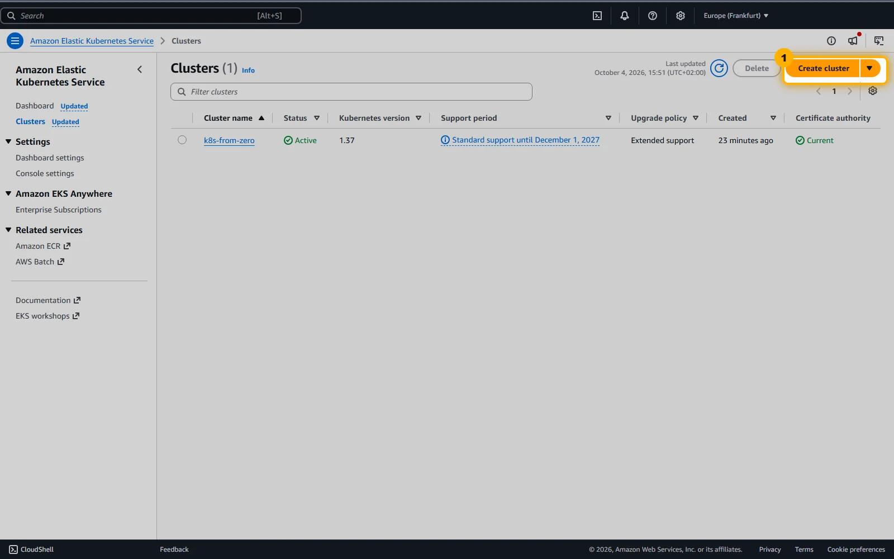

**2. Configuration options → Custom configuration.** "Quick configuration" creates an **EKS Auto Mode** cluster
where AWS also manages the nodes. Custom shows every option.

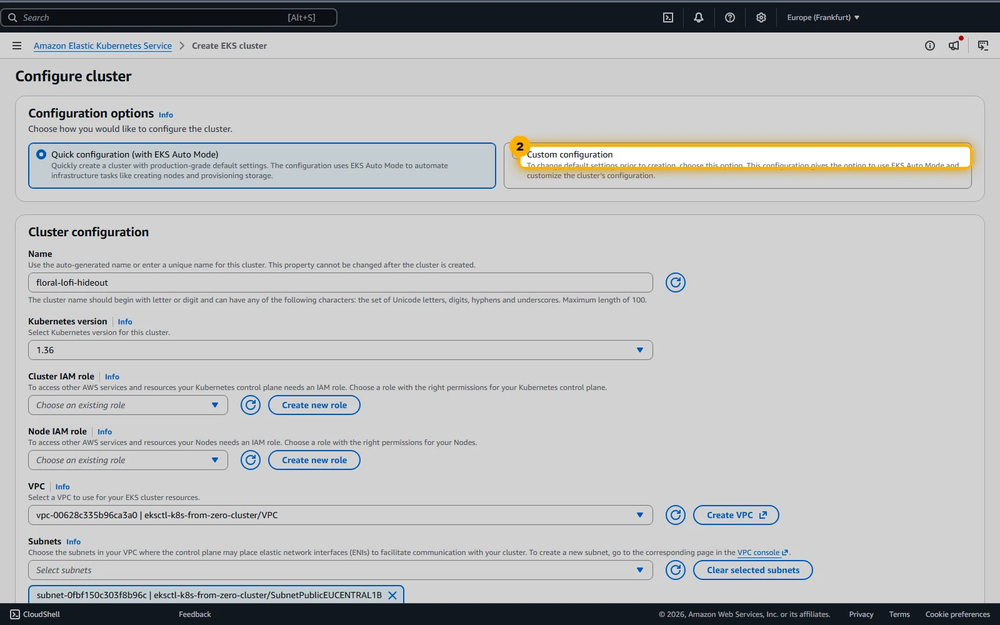

**3. EKS Auto Mode → switch it off.** Auto Mode is on by default. We want the classic setup of this lesson: a managed
node group that you can see and size yourself. The console then reminds you to create compute after the cluster.

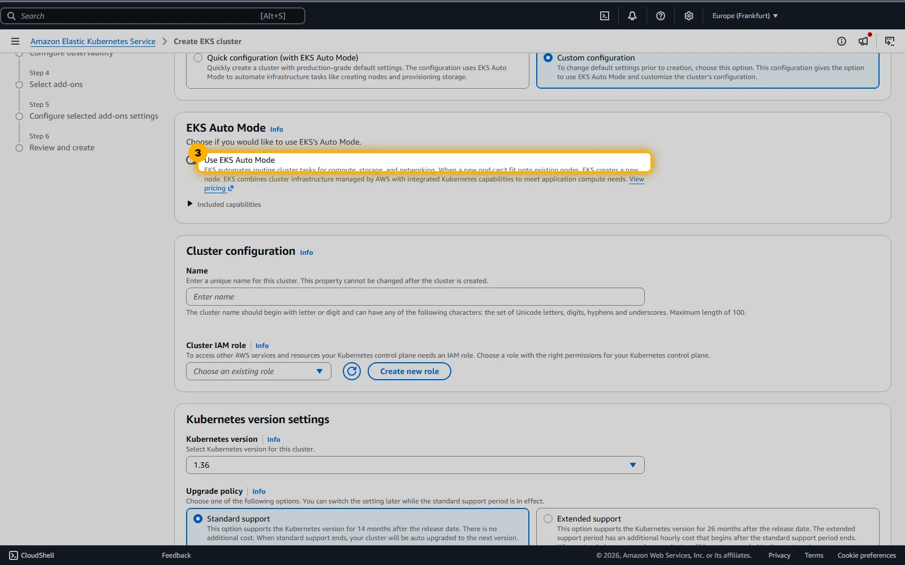

**4. Name and Cluster IAM role.** Enter the name, then choose a role EKS can assume to manage AWS resources for the
cluster (policy `AmazonEKSClusterPolicy`). **Create new role** opens IAM with the right policy; here the role eksctl
created is selected.

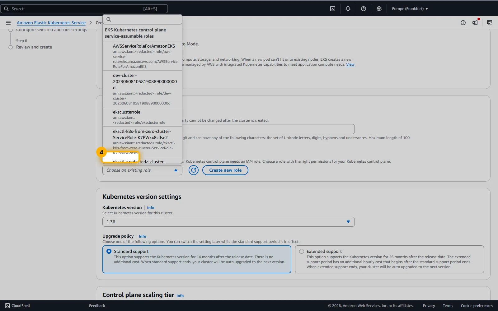

**5. Kubernetes version.** The console pre-selects the default version (1.36 at the time of recording); open the list
and choose **1.37**. The list shows the end of standard and extended support for each version. Keep **Standard
support** as the upgrade policy: extended support costs extra per hour once standard support ends.

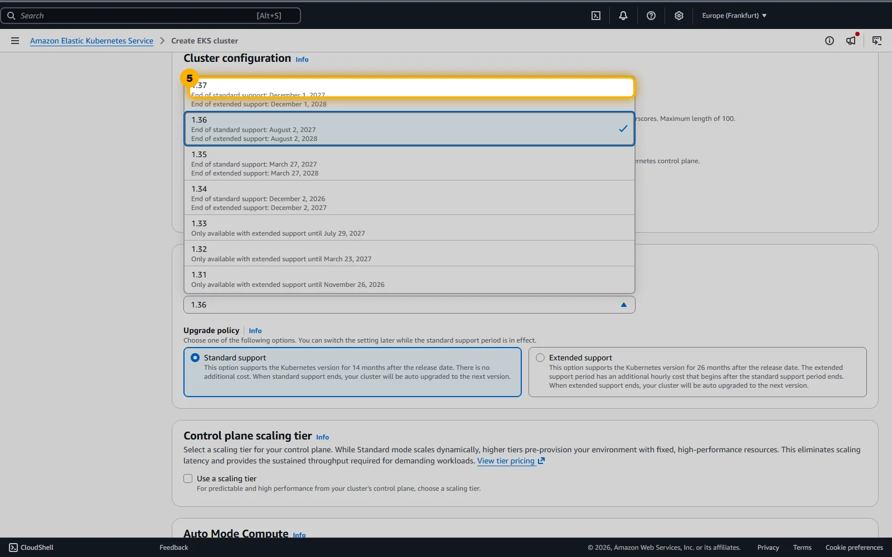

**6. Cluster access.** **Allow cluster administrator access** gives your IAM identity cluster-admin (eksctl does the
same); authentication mode **EKS API** uses access entries instead of the old `aws-auth` ConfigMap.

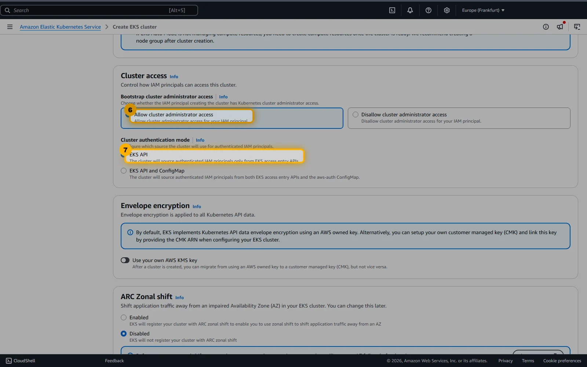

**7. Next.** Envelope encryption, ARC zonal shift and deletion protection can stay at their defaults for a lab.

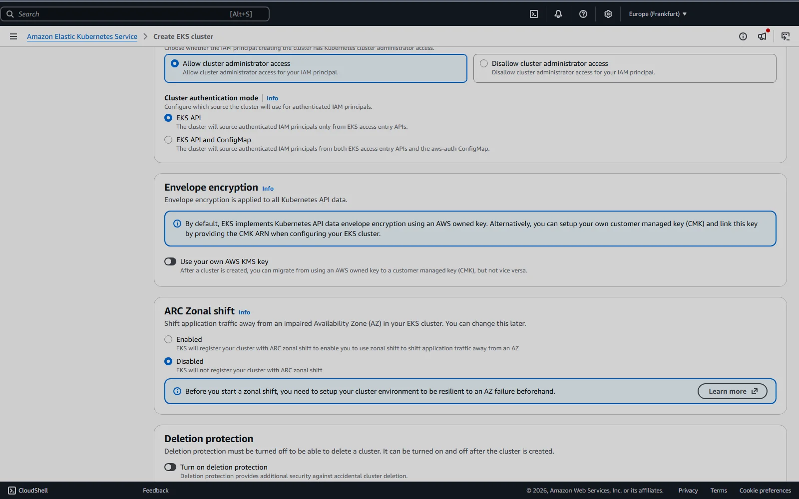

**8. Specify networking.** Choose a VPC and at least two subnets in different availability zones (the console
pre-selects the default VPC; eksctl creates a dedicated one instead). Endpoint access **Public and private** is the
default.

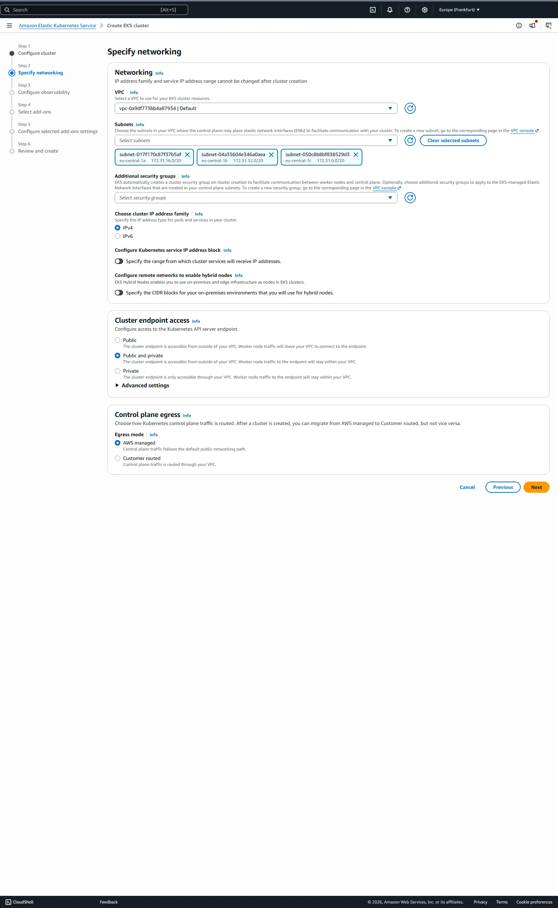

**9. Configure observability** (control plane logs; off by default, CloudWatch charges when on) and **10. Select
add-ons**: Amazon VPC CNI, CoreDNS and kube-proxy are the essential ones.

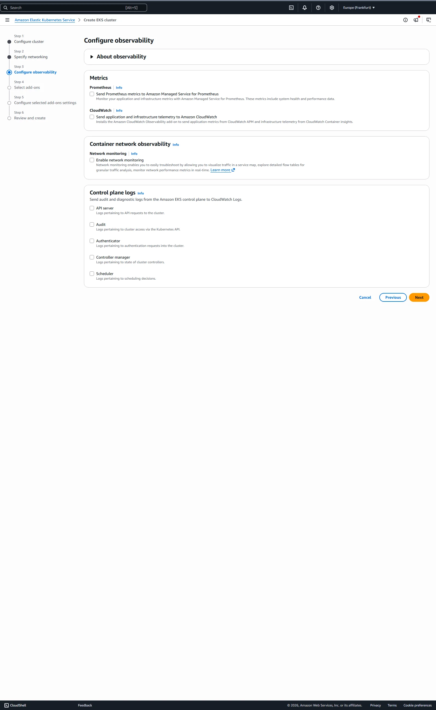

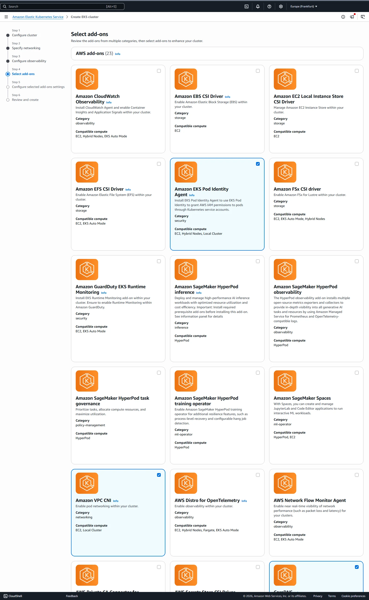

**11. Configure selected add-ons settings** (versions; keep the defaults) and **12. Review and create.**

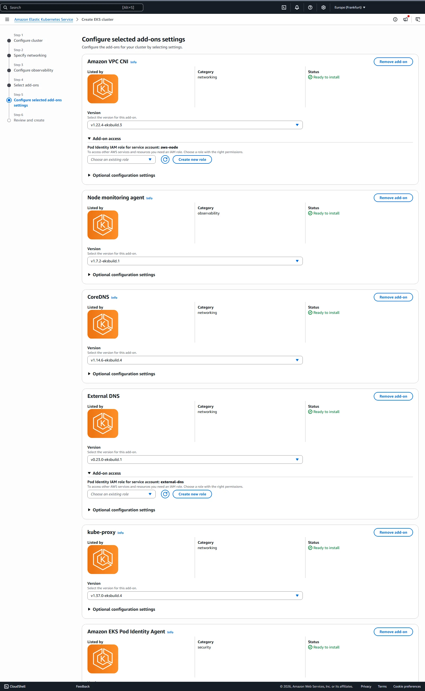

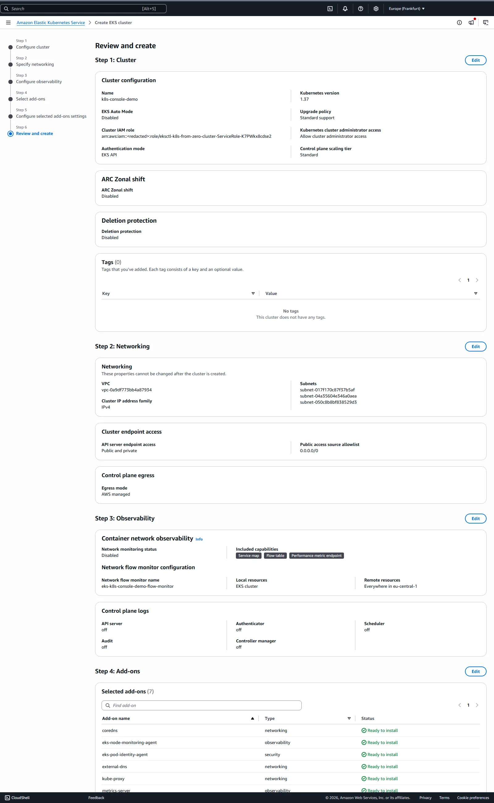

**13. Create.** The last click. We did **not** click it: the cluster already exists, created from `cluster.yaml`.

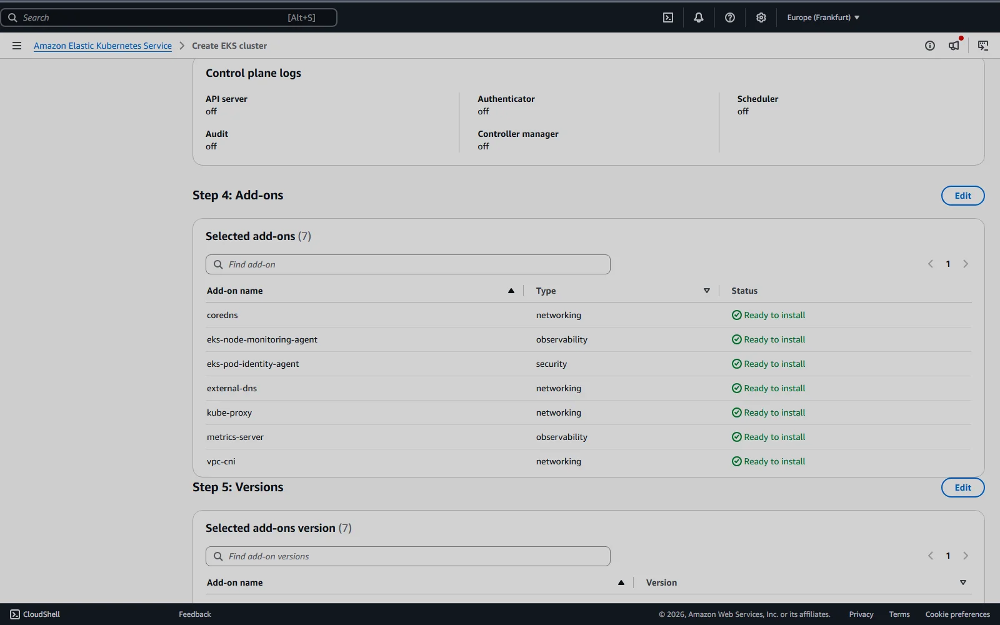

**14. Afterwards: Compute → Add node group.** Name, node IAM role (`AmazonEKSWorkerNodePolicy`,
`AmazonEKS_CNI_Policy`, `AmazonEC2ContainerRegistryReadOnly`), instance type `t3.medium`, size 2, private subnets.

eksctl does all of these steps from one file, also creates the IAM roles and the VPC, and deletes everything again
with one command. That is what we use.

## Step 5 · Create the cluster

```text
⚠️ CREATES BILLABLE AWS RESOURCES (about $0.25-0.30 per hour). Do the cleanup step the same day.
```

<!-- test: aws; timeout=2700; contains=EKS cluster "k8s-from-zero" in "eu-central-1" region is ready; output=tail:14 -->
```bash
eksctl create cluster -f eks/cluster.yaml
```

```text
...
2026-10-04 15:42:29 [ℹ]  no tasks
2026-10-04 15:42:29 [✔]  all EKS cluster resources for "k8s-from-zero" have been created
2026-10-04 15:42:29 [ℹ]  nodegroup "workers" has 2 node(s)
2026-10-04 15:42:29 [ℹ]  node "ip-10-50-110-141.eu-central-1.compute.internal" is ready
2026-10-04 15:42:29 [ℹ]  node "ip-10-50-151-189.eu-central-1.compute.internal" is ready
2026-10-04 15:42:29 [ℹ]  waiting for at least 2 node(s) to become ready in "workers"
2026-10-04 15:42:29 [ℹ]  nodegroup "workers" has 2 node(s)
2026-10-04 15:42:29 [ℹ]  node "ip-10-50-110-141.eu-central-1.compute.internal" is ready
2026-10-04 15:42:29 [ℹ]  node "ip-10-50-151-189.eu-central-1.compute.internal" is ready
2026-10-04 15:42:29 [✔]  created 1 managed nodegroup(s) in cluster "k8s-from-zero"
2026-10-04 15:42:29 [ℹ]  creating addon: metrics-server
2026-10-04 15:42:29 [ℹ]  successfully created addon: metrics-server
2026-10-04 15:42:30 [ℹ]  kubectl command should work with "~/.kube/config", try 'kubectl --kubeconfig=~/.kube/config get nodes'
2026-10-04 15:42:30 [✔]  EKS cluster "k8s-from-zero" in "eu-central-1" region is ready
```

What happened, in order:

1. a CloudFormation stack `eksctl-k8s-from-zero-cluster` created the VPC, subnets, NAT gateway, security groups and the
   cluster IAM role, then the **EKS control plane** (the longest wait: about 10 minutes)
2. EKS add-ons were installed (VPC CNI, CoreDNS, kube-proxy, ...)
3. a second stack `eksctl-k8s-from-zero-nodegroup-workers` created the node IAM role and the **managed node group**:
   two EC2 instances that boot, start the kubelet and join the cluster on their own (no `kubeadm join`)
4. eksctl wrote a **kubeconfig** entry for the cluster and made it the current context

## Step 6 · kubeconfig

<!-- test: aws; contains=k8s-from-zero; output -->
```bash
kubectl config current-context
```

```text
<iam-user>@k8s-from-zero.eu-central-1.eksctl.io
```

kubectl authenticates to EKS with your AWS identity: the kubeconfig entry runs `aws eks get-token` on every request.
On another computer, or after deleting the entry, recreate it with:

<!-- test: aws; contains=context -->
```bash
aws eks update-kubeconfig --name k8s-from-zero --region eu-central-1
```

## Step 7 · Verify the cluster

<!-- test: aws; contains=ACTIVE; output -->
```bash
aws eks describe-cluster --name k8s-from-zero --query 'cluster.{status:status,version:version,platform:platformVersion}' --output table
```

```text
-----------------------------------
|         DescribeCluster         |
+----------+----------+-----------+
| platform | status   |  version  |
+----------+----------+-----------+
|  eks.4   |  ACTIVE  |  1.37     |
+----------+----------+-----------+
```

<!-- test: aws; contains=is running at; output -->
```bash
kubectl cluster-info
```

```text
Kubernetes control plane is running at https://2C51B6486A48B7CF9449C5157F9B59EA.gr7.eu-central-1.eks.amazonaws.com
CoreDNS is running at https://2C51B6486A48B7CF9449C5157F9B59EA.gr7.eu-central-1.eks.amazonaws.com/api/v1/namespaces/kube-system/services/kube-dns:dns/proxy

To further debug and diagnose cluster problems, use 'kubectl cluster-info dump'.
```

<!-- test: aws; retry=30; contains=Ready; absent=NotReady; output -->
```bash
kubectl get nodes -o wide
```

```text
NAME                                             STATUS   ROLES    AGE   VERSION               INTERNAL-IP     EXTERNAL-IP   OS-IMAGE                        KERNEL-VERSION                            CONTAINER-RUNTIME
ip-10-50-110-141.eu-central-1.compute.internal   Ready    <none>   61s   v1.37.0-eks-3b4a6ca   10.50.110.141   <none>        Amazon Linux 2023.12.20260928   6.18.51-120.162.amzn2023.x86_64 (amd64)   containerd://2.2.7+unknown
ip-10-50-151-189.eu-central-1.compute.internal   Ready    <none>   63s   v1.37.0-eks-3b4a6ca   10.50.151.189   <none>        Amazon Linux 2023.12.20260928   6.18.51-120.162.amzn2023.x86_64 (amd64)   containerd://2.2.7+unknown
```

Two nodes, both workers, running Amazon Linux 2023 with containerd. **There is no control-plane node in this list**:
the control plane is not in your account.

<!-- test: aws; retry=30; absent=Pending; output -->
```bash
kubectl get pods -A
```

```text
NAMESPACE     NAME                              READY   STATUS              RESTARTS   AGE
kube-system   aws-node-68mqd                    2/2     Running             0          64s
kube-system   aws-node-tdb5w                    2/2     Running             0          62s
kube-system   coredns-c7b948bf9-5z9n5           1/1     Running             0          4m23s
kube-system   coredns-c7b948bf9-8x7ss           1/1     Running             0          4m23s
kube-system   kube-proxy-cn9pb                  1/1     Running             0          62s
kube-system   kube-proxy-wgxks                  1/1     Running             0          64s
kube-system   metrics-server-7584d9c877-dnjfp   0/1     ContainerCreating   0          0s
kube-system   metrics-server-7584d9c877-nt295   0/1     ContainerCreating   0          0s
```

Compare this with the kubeadm cluster: no `etcd`, no `kube-apiserver`, no `kube-scheduler` Pods. What you see is what
runs on **your** nodes: `aws-node` (the VPC CNI), `kube-proxy`, CoreDNS, and EKS's other default add-ons.

<!-- test: aws; contains=workers; output -->
```bash
eksctl get nodegroup --cluster k8s-from-zero
```

```text
CLUSTER		NODEGROUP	STATUS	CREATED			MIN SIZE	MAX SIZE	DESIRED CAPACITY	INSTANCE TYPE	IMAGE ID		ASG NAME						TYPE
k8s-from-zero	workers		ACTIVE	2026-10-04T13:40:35Z	2		2		2			t3.medium	AL2023_x86_64_STANDARD	eks-workers-a2d08392-8acd-c919-9666-638daba7aa13	managed
```

### A test workload, with a real load balancer

On EKS, a Service of type `LoadBalancer` makes AWS create a load balancer with a public DNS name:

<!-- test: aws; contains=deployment.apps/web created -->
```bash
kubectl create deployment web --image=nginx:1.30-alpine --replicas=2
kubectl expose deployment web --port=80 --type=LoadBalancer
```

<!-- test: aws; retry=60; contains=successfully rolled out; output -->
```bash
kubectl rollout status deployment/web --timeout=10s
kubectl get pods -l app=web -o wide
```

```text
deployment "web" successfully rolled out
NAME                   READY   STATUS    RESTARTS   AGE     IP              NODE                                             NOMINATED NODE   READINESS GATES
web-6f5d6d9c94-6qgjl   1/1     Running   0          3m55s   10.50.159.242   ip-10-50-151-189.eu-central-1.compute.internal   <none>           <none>
web-6f5d6d9c94-qf8nx   1/1     Running   0          3m55s   10.50.101.146   ip-10-50-110-141.eu-central-1.compute.internal   <none>           <none>
```

The Pod IPs are addresses from the VPC's private subnets (the VPC CNI at work).

<!-- test: aws; retry=60; contains=elb.amazonaws.com; output -->
```bash
kubectl get service web
```

```text
NAME   TYPE           CLUSTER-IP       EXTERNAL-IP                                                                  PORT(S)        AGE
web    LoadBalancer   172.20.118.174   a72ba0a318ba641bc93e45e807ae8628-1535282912.eu-central-1.elb.amazonaws.com   80:31399/TCP   3m55s
```

The DNS name in `EXTERNAL-IP` takes a minute or two to start answering:

<!-- test: aws; retry=90; timeout=30; contains=Welcome to nginx; output -->
```bash
LB=$(kubectl get service web -o jsonpath='{.status.loadBalancer.ingress[0].hostname}')
curl -s --max-time 5 "http://$LB" | grep -o '<title>.*</title>'
```

```text
<title>Welcome to nginx!</title>
```

**The cluster works:** nodes Ready, system Pods running, a Deployment, and a Service reachable from the internet.

## Step 8 · In the AWS Console

The cluster you just created, as the console shows it (recorded during this run).

**Overview:** status `Active`, Kubernetes `1.37`, platform version, API server endpoint, OIDC provider URL and the
cluster IAM role eksctl created.

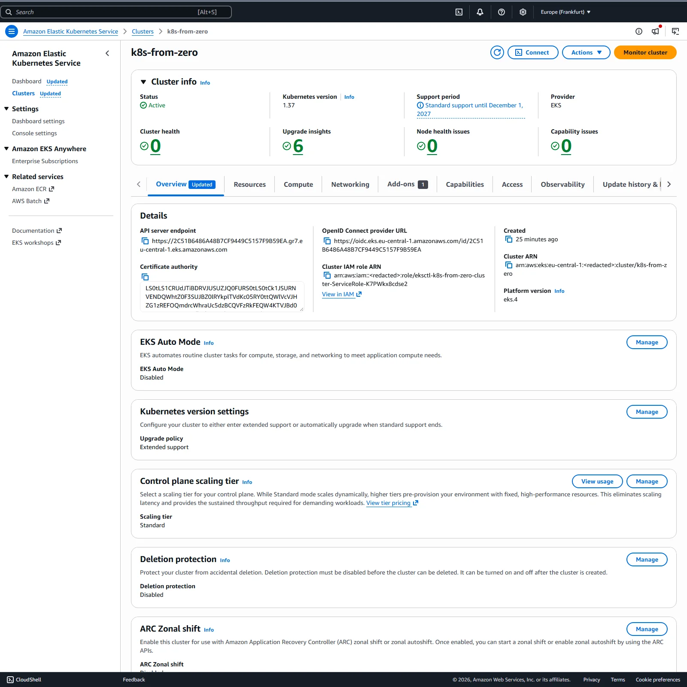

**Compute:** the node group `workers`. The node list above it says **Unauthorized**, and so does **Resources**: the
console reads nodes and Pods **through the Kubernetes API**, with the identity you are logged in with. Our screenshots
were taken with a separate read-only console identity that has no EKS access entry, so Kubernetes refuses it. That is
access entries working: an AWS permission like `ReadOnlyAccess` is not enough to see inside the cluster. Give an
identity an access entry (with e.g. `AmazonEKSViewPolicy`) and the lists fill in.

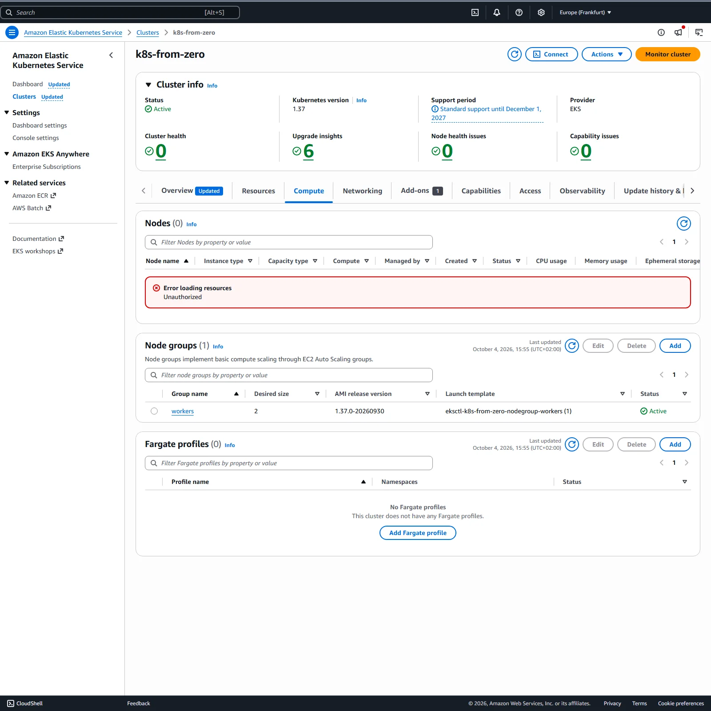

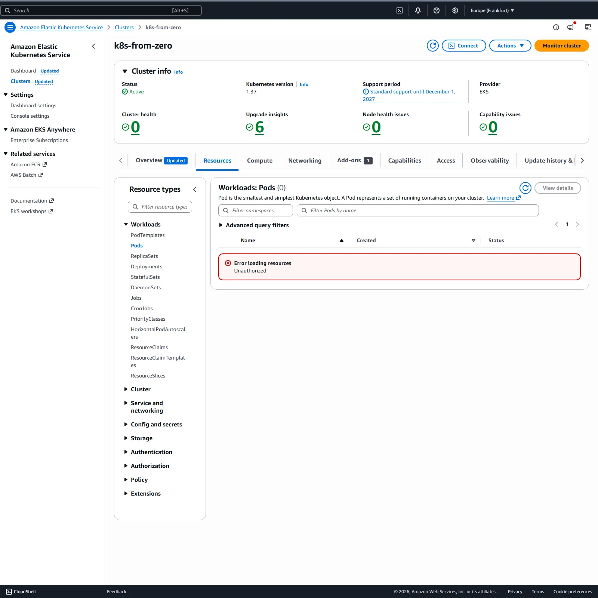

**Networking:** the VPC and the six subnets from `cluster.yaml`, the cluster security group, endpoint access "Public
and private". **Add-ons:** VPC CNI, CoreDNS, kube-proxy and metrics-server. **Access:** authentication mode EKS API and
the access entries (the node role, the AWS service role, your admin identity).

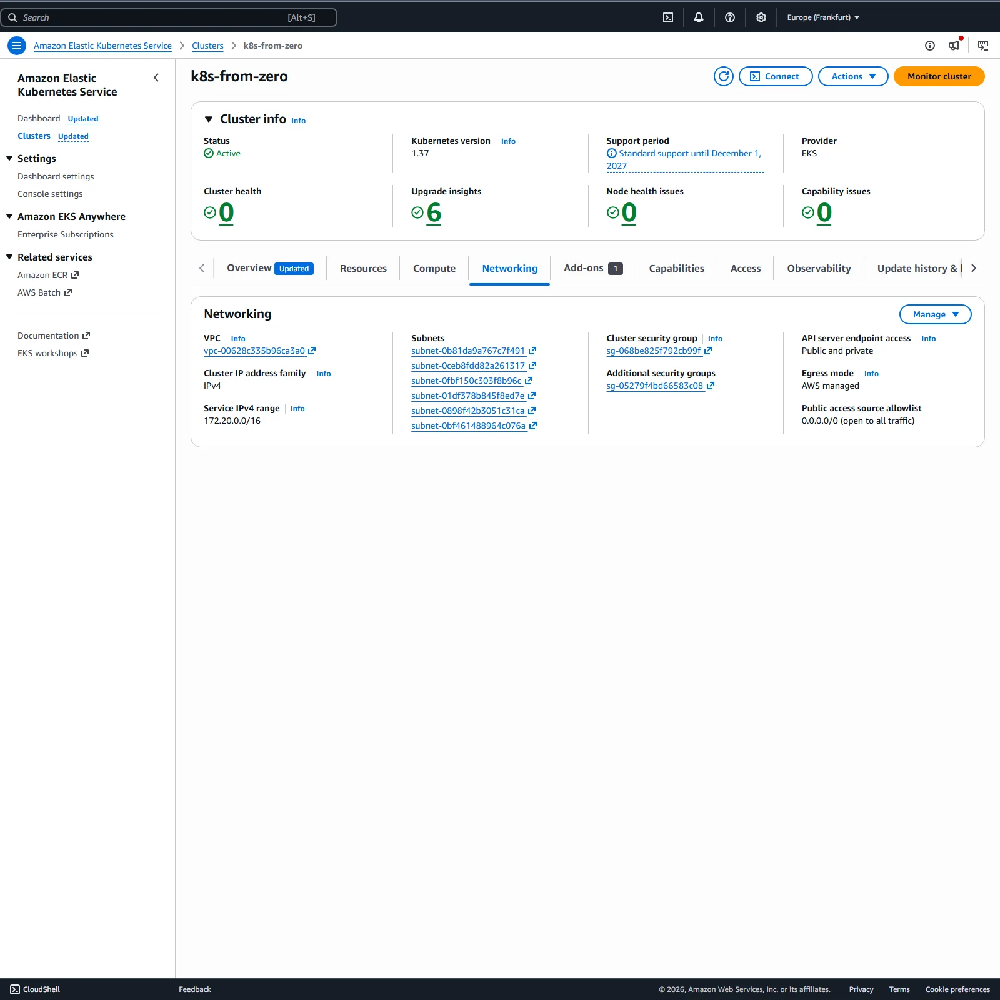

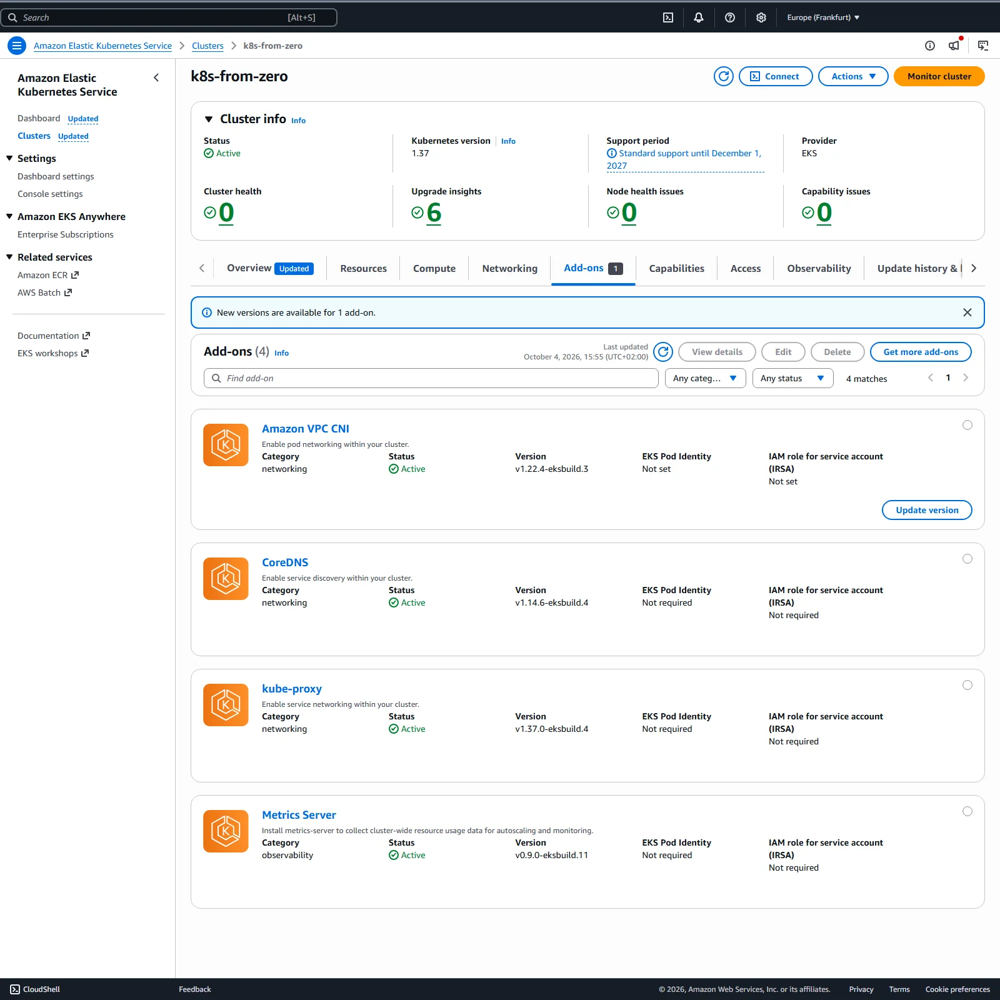

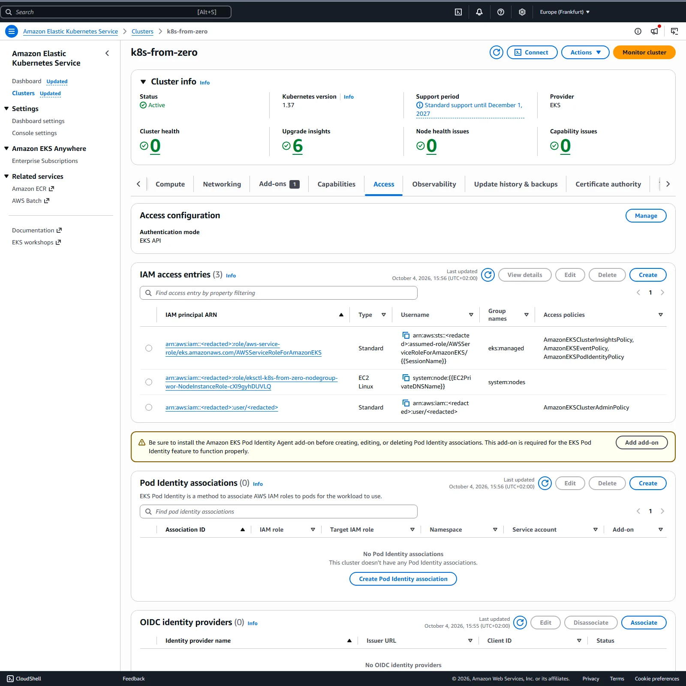

Outside EKS: **CloudFormation** lists the two stacks eksctl created (cluster and node group), **EC2** the two worker
instances in two availability zones, and **Load Balancers** the load balancer Kubernetes created for the `web` Service.

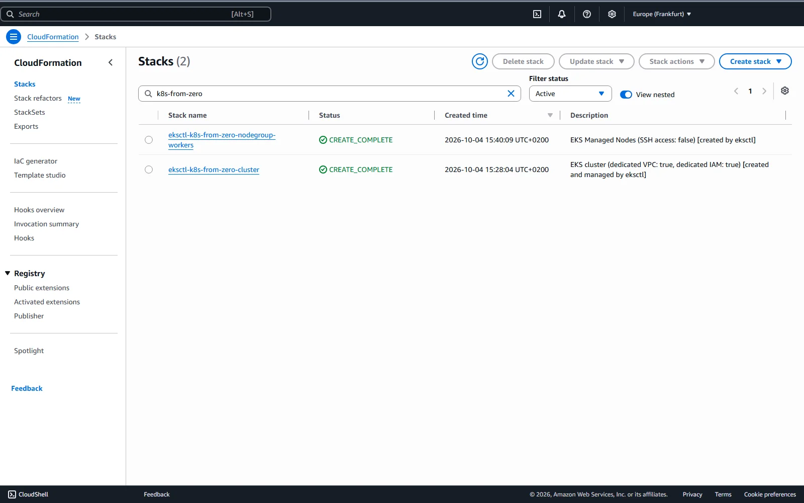

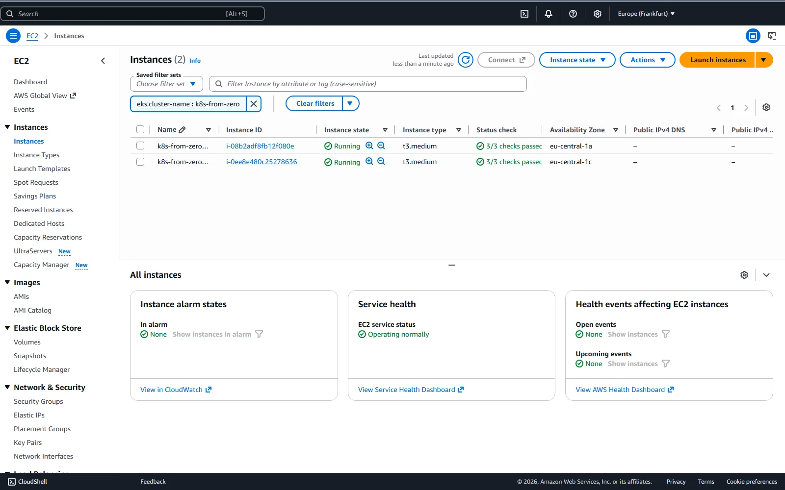

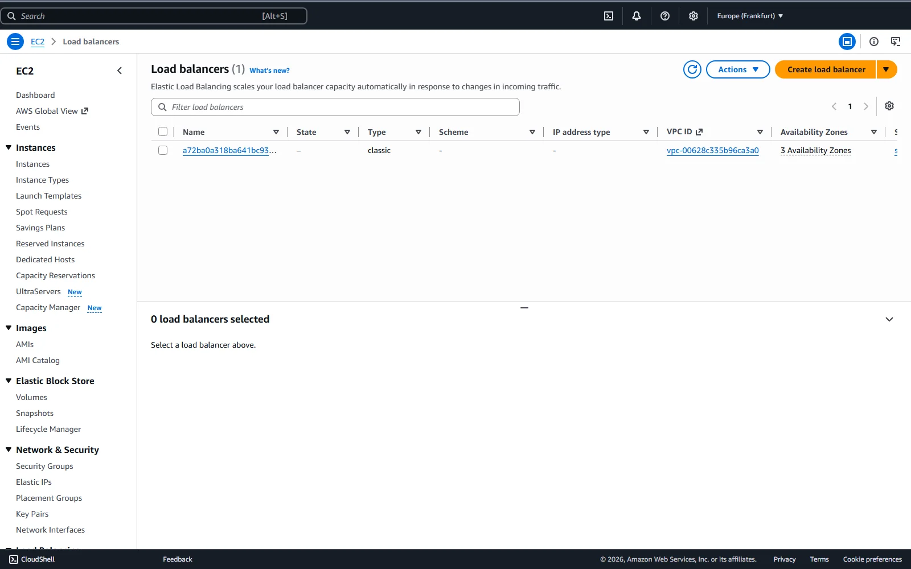

Note the **Upgrade policy: Extended support** in the cluster list: eksctl left the AWS default. For a cluster you keep,
set it to Standard (`upgradePolicy: {supportType: STANDARD}` in the ClusterConfig, or **Manage** in the console) so it
is upgraded instead of paying the extended-support fee once standard support ends.

## Common errors

| Symptom | Cause | Fix |
|---|---|---|
| `AccessDenied` / `not authorized to perform` during create | your identity lacks permissions | ask for the EKS/EC2/IAM/CloudFormation permissions, or another region |
| `You must be logged in to the server (Unauthorized)` | your identity has no access entry on the cluster | `aws eks create-access-entry` / ask the cluster owner |
| `EXTERNAL-IP` stays `<pending>` | load balancer still being created, or subnets lack the ELB tags | wait 1-2 minutes; eksctl's VPC is tagged correctly |
| `eksctl delete cluster` fails deleting the VPC | a load balancer created by Kubernetes still exists | delete the Service first (cleanup step 1) |

## Cleanup

Delete everything the same day, in the right order, and verify: [eks/cleanup.md](cleanup.md).

## Practical challenge

[labs/04-eks-installation.md](../labs/04-eks-installation.md)

## Real-world usage

EKS is where you meet Kubernetes in AWS-based companies: production workloads, internal platforms, CI runners, data
jobs. Your day-to-day work there is node groups (or Karpenter/Auto Mode), IAM access, networking, add-on and cluster
upgrades, and cost: not installing control planes.

## Key takeaways

- AWS runs and secures the control plane; you own the VPC, the nodes, access, add-ons, workloads and the bill.
- eksctl turns one YAML file into CloudFormation stacks: VPC, IAM roles, cluster, node group, and deletes them again.
- kubectl authenticates with your AWS identity through the kubeconfig entry.
- No control-plane Pods are visible; Pods get VPC IP addresses from the VPC CNI.
- Clean up in the right order (Services with load balancers first), then verify that nothing is left.

Next: [docs/11 · Cluster verification](../docs/11-cluster-verification.md) · [docs/13 · Comparison](../docs/13-installation-comparison.md)
